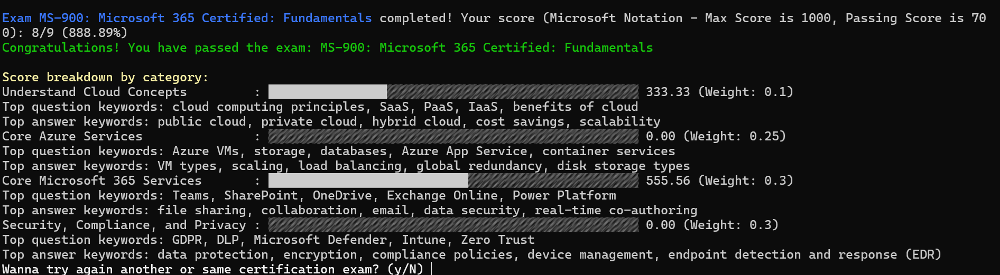

# Azure Certification Practice Simulator 🛠️

Welcome to the **Azure Certification Practice Simulator**! This project provides an interactive test simulator designed to help engineers and IT professionals practice for **all major Azure certifications** in a structured and user-friendly environment. It is **specifically tailored for Accenture's Expert Technology Consulting (ETC)** organization, focusing on the needs of our SMB B2B customers. 

This tool is developed **in-house for our ETC engineers**, aiming to offer a **free**, effective, and immersive way to study for Azure certifications. The simulator covers a wide range of certifications, from fundamental to advanced levels, making it ideal for **skill enhancement** across different career stages. 🚀

---

## Features 🎯

- **Comprehensive Question Bank**: Questions sourced and structured based on actual certification exams.
- **Interactive Practice Sessions**: Real-time feedback on your answers, with explanations to deepen your understanding.
- **Certification-Specific CSV Files**: Each certification has its own CSV file loaded with questions, dynamically updated based on user selection.
- **Tailored for Accenture ETC**: Custom-built for engineers in Accenture's Microsoft-focused Expert Technology Consulting (ETC) group.
- **Simple, Elegant Design**: User-friendly menu-driven interface to select the desired certification.

---

## Recent Enhancements 🌟

We are constantly improving the **Azure Certification Practice Simulator** to offer the best possible preparation experience for our users. Below are the exciting new features from our latest update:

- **Language Selection**: You can now choose to take the exam in English, Spanish, Portuguese, French, or Japanese, making the simulator accessible to a broader audience across different regions.
  
- **Test Selection and Simulated Exams**: The system now offers an intuitive menu for selecting the Azure certification exam you wish to practice, ranging from **AZ-900 to advanced levels like AZ-305** and more.

- **Accurate Answer Validation**: We've added robust validation logic to ensure that you receive immediate and precise feedback on each question. Additionally, detailed explanations are provided to help you deepen your understanding of the topics.

- **Final Scoring with Visual Feedback**: After completing a practice session, the simulator now calculates your **total score** and presents it in a clear, easy-to-understand format. Additionally, we've introduced a **visual ASCII-based bar chart** to provide an engaging representation of your performance. Here’s an example of how it looks:

    ```plaintext
    Exam completed! Your score (Microsoft Notation - Max Score is 1000, Passing Score is 700): 22/24 (916.67%)
    Congratulations! You have passed the exam.

Score breakdown by category:

        Describe cloud concepts                  : ▒▒▒▒▒▒▒▒▒▒▒▒▒▒▒▒▒▒▒▒▒▒▒▒▒▒▒▒▒▒▒▒▒▒▒▒▒▒▒▒▒▒▒▒▒▒▒▒▒▒ 0.00

        Describe Azure architecture and services : ███████████████████████████████████████▒▒▒▒▒▒▒▒▒▒▒ 791.67

        Describe Azure management and governance : ██████▒▒▒▒▒▒▒▒▒▒▒▒▒▒▒▒▒▒▒▒▒▒▒▒▒▒▒▒▒▒▒▒▒▒▒▒▒▒▒▒▒▒▒▒ 125.00

    ```





These updates further enhance the realism of the exam simulation and offer more insightful feedback, allowing you to track your progress and focus on areas for improvement.


---

## Supported Azure Certifications 📜

This simulator covers **all major Azure certifications**, including but not limited to:

- **AZ-900**: Microsoft Azure Fundamentals
- **AZ-104**: Microsoft Azure Administrator
- **AZ-204**: Developing Solutions for Microsoft Azure
- **AZ-305**: Designing Microsoft Azure Infrastructure Solutions
- **AZ-400**: Designing and Implementing Microsoft DevOps Solutions
- **AZ-500**: Microsoft Azure Security Technologies
- **AZ-700**: Designing and Implementing Microsoft Azure Networking Solutions
- **AZ-800**: Administering Windows Server Hybrid Core Infrastructure
- **AZ-900** to **AZ-140**: All certifications in the Azure path
- **MS-900**: Microsoft 365 Fundamentals

---

## How It Works ⚙️

Upon launching the simulator, you are presented with a menu to choose the Azure certification you'd like to practice:

```plaintext
1. AZ-900: Microsoft Azure Fundamentals
2. AZ-104: Microsoft Azure Administrator
3. AZ-204: Developing Solutions for Microsoft Azure
4. Exit
```

After selecting a certification, the corresponding **CSV file** is loaded, and the quiz begins. You’ll receive a question, multiple-choice answers, and immediate feedback on your selection, including a detailed explanation.

---

### Key Components 🧩

- **User Interface**: The frontend where users interact with the simulator.
- **Exam Simulator Logic**: Core functionality that manages the question flow, scoring, and feedback mechanism.
- **SuperMemo-2 Algorithm**: A spaced repetition algorithm designed to enhance long-term retention by adjusting the frequency of question reviews.
- **Weighted Random Selection**: Questions are selected based on their weight, focusing on areas where users struggle the most.
- **Difficult Question Review**: Incorrectly answered questions are revisited to ensure mastery.
- **Azure Cloud Integration**: Leveraging the power of the cloud for scalability, storage, and analytics.
  
This architecture ensures efficient delivery and processing of exam simulations, optimized for the best learning experience.

---

## Getting Started 🚀

### Prerequisites

- Python 3.x installed on your machine.
- Basic knowledge of command-line interface (CLI) operations.

### Installation


1. **Install Python 3.6.12**:
   - For **Windows**:
     - Download the installer from the [official Python website](https://www.python.org/downloads/release/python-3612/).
     - Run the installer and ensure you check the box that says "Add Python to PATH".
   - For **macOS**:
     ```bash
     brew install python@3.6
     ```
   - For **Linux** (Debian-based):
     ```bash
     sudo apt update
     sudo apt install python3.6 python3-pip
     ```

2. **Install pip** (if not included with Python):
   ```bash
   python3.6 -m ensurepip
   ```

3. **Install required packages**:
    ```bash
    pip install spacy pandas nltk googletrans requests aiohttp
    ```

4. Clone this repository to your local machine (use Visual Studio 2022):
    ```bash
    git clone git@ssh.dev.azure.com:v3/viniciof/CertTester/ETC-CertTester
    ```

5. Navigate to the project directory:
    ```bash
    cd azure_certification_simulator
    ```

6. Install any necessary dependencies (if any) and run the Python script:
    ```bash
    python3.6 azure_certification_simulator.py
    ```

### Usage

Once the simulator is running, follow the on-screen prompts to select the certification you wish to practice. After completion, you'll receive a summary of your performance.

---

## Why This Simulator? 🤔

This tool is designed as a **no-cost**, **non-paid** initiative aimed at empowering Accenture engineers, specifically those part of the **ETC organization**. It supports engineers in **certification preparation** and aligns with Accenture's goal of continuously developing our team's skills, particularly for **Microsoft-focused projects**.

Developed **by engineers, for engineers**, this simulator reflects the real-world exam environments and allows for effective self-paced learning. It also complements our broader **ETC learning strategy**, encouraging ongoing professional development and certification success.

---

## Architecture Diagram

Below is the architecture diagram for the **Azure Certification Exam Simulator (ACES)**. This diagram provides an overview of the key components, including the user interface, Exam Simulator logic, SuperMemo-2 algorithm, weighted random selection, and difficult question review process, all integrated and hosted on Microsoft Azure.


### Key Components:
- **User Interface**: The frontend where users interact with the simulator.
- **Exam Simulator Logic**: Core functionality that manages the question flow, scoring, and feedback mechanism.
- **SuperMemo-2 Algorithm**: A spaced repetition algorithm designed to enhance long-term retention by adjusting the frequency of question reviews.
- **Weighted Random Selection**: Questions are selected based on their weight, focusing on areas where users struggle the most.
- **Difficult Question Review**: Incorrectly answered questions are revisited to ensure mastery.
- **Azure Cloud Integration**: Leveraging the power of the cloud for scalability, storage, and analytics.
  
This architecture ensures efficient delivery and processing of exam simulations, optimized for the best learning experience.

---

## Contributing 👩‍💻👨‍💻

We welcome contributions from Accenture’s internal team! Feel free to:

- Report issues
- Submit pull requests for new features
- Suggest improvements or additional certifications

For contribution guidelines, please refer to the `CONTRIBUTING.md` file.

---

## TO-DOs

To enhance the effectiveness of the **Azure Certification Practice Simulator**, the following improvements will be implemented to better integrate spaced repetition techniques and user-focused review sessions. These features aim to optimize long-term retention and provide users with a targeted review of difficult questions.

### 1. Weighted Random Selection

- **Objective**: Ensure that questions are selected based on a weighted probability, where difficult questions or those answered incorrectly receive higher weights for reappearance.
- **Implementation**:
  - Create a `question_weights` dictionary to track each question's weight.
  - Implement a `weighted_random_selection` method to choose questions based on their weights.
  - Build an `update_question_weight` method to adjust weights dynamically after correct or incorrect answers.

### 2. Revisiting Difficult Questions

- **Objective**: Give users the opportunity to revisit questions they answered incorrectly at the end of the session, improving their understanding and retention.
- **Implementation**:
  - Add a `difficult_questions` list to store incorrectly answered questions.
  - Implement the `revisit_difficult_questions` method, which is called at the end of the exam to allow users to review challenging questions.

### 3. Spaced Repetition Algorithm (SuperMemo-2)

- **Objective**: Leverage the **SuperMemo-2 algorithm** to calculate optimal review intervals for each question, enhancing retention over time.
- **Implementation**:
  - Create a `question_history` dictionary to track when each question was last answered and whether the answer was correct.
  - Develop a `get_next_review_date` method to calculate the next review date for each question based on the SuperMemo-2 algorithm.
  - Implement the `run_spaced_repetition_session` method, allowing users to review due questions in dedicated spaced repetition sessions.

### 4. Update Main Function

- **Objective**: Refactor the main function to incorporate the enhanced question selection, spaced repetition sessions, and review of difficult questions at the end of each exam.
- **Implementation**:
  - Replace the current `ExamSimulator` class with the new `EnhancedExamSimulator` class.
  - Ensure that necessary modules such as `datetime` and `random` are properly imported at the beginning of the file.

### 5. Benefits of These Enhancements

- **Focusing on Difficult Questions**: The simulator will prioritize questions that users struggle with, providing more frequent review opportunities for these items.
- **Targeted Review Sessions**: Users will be able to revisit incorrect answers at the end of each session, fostering a better understanding of challenging material.
- **Scientifically-Backed Spaced Repetition**: The inclusion of the SuperMemo-2 algorithm will optimize long-term retention by scheduling reviews at scientifically-determined intervals.

These enhancements will not only make the simulator more efficient in helping users prepare for Azure certification exams, but also ensure the study sessions are aligned with proven techniques for memory retention and recall.

---

## How This Simulator Competes Against Duolingo in the Azure Certification Preparation Niche

The **Azure Certification Practice Simulator** leverages advanced learning algorithms and spaced repetition techniques, such as the **SuperMemo-2 algorithm**, to deliver a highly effective and targeted study experience for those pursuing Azure certifications. While platforms like Duolingo are popular in language learning due to their engaging format and adaptive learning methods, this simulator offers a specialized focus on IT certifications, with several competitive advantages for users preparing for Azure exams.

### 1. Specialized Focus on Azure Certifications

Unlike Duolingo, which is primarily designed for language learning, this simulator is built specifically for **Azure certification preparation**. It integrates exam-specific content, including Azure services, architecture, governance, and security topics. This deep integration allows the simulator to:
- Provide tailored question banks reflecting real-world Azure certification scenarios.
- Incorporate up-to-date exam objectives directly aligned with Microsoft's certification requirements.
- Focus on IT professionals' needs, including cloud concepts, Azure workloads, and Azure Active Directory.

### 2. Advanced Algorithms for Learning Efficiency

The simulator incorporates a variety of **learning algorithms** that ensure the user is studying efficiently and effectively, focusing more on areas that need improvement:
- **Weighted Random Selection**: Unlike Duolingo’s more static question selection model, this simulator dynamically adjusts the difficulty of questions a user encounters based on their performance. By tracking question difficulty and user response, the simulator ensures that more challenging topics are revisited more often, helping users focus on areas where they need the most improvement.
  - The use of a `question_weights` dictionary and the `weighted_random_selection` method allows the system to smartly prioritize difficult questions.

- **Revisiting Difficult Questions**: After each session, the simulator provides users with a targeted review of the questions they struggled with. This feedback loop ensures that learners don’t move on without fully understanding their mistakes, a key factor in achieving certification readiness. 
  - The `difficult_questions` list and `revisit_difficult_questions` method offer a structured way to focus on tough questions immediately after practice sessions.

### 3. SuperMemo-2 Algorithm for Long-Term Retention

One of the primary reasons Duolingo succeeds in language learning is its adaptive learning and repetition model. The **Azure Certification Practice Simulator** builds on this concept by incorporating the **SuperMemo-2 algorithm**—a scientifically-backed spaced repetition system used to optimize long-term retention:
- **Personalized Review Intervals**: The SuperMemo-2 algorithm calculates optimal review dates based on when the user last answered a question and whether it was correct. This helps prevent cramming and fosters long-term retention, which is essential for passing rigorous exams like Azure certifications.
  - The `question_history` dictionary tracks previous interactions, while the `get_next_review_date` function calculates the ideal time to revisit questions.

- **Spaced Repetition Sessions**: Instead of following Duolingo's linear progression, the simulator includes a dedicated spaced repetition session. Users can focus on questions that are due for review based on their personal learning schedule, ensuring efficient use of their study time and maximizing retention before the certification exam.

### 4. Adaptive Learning Path for Certification Success

By focusing on areas where users struggle and scheduling reviews at optimal intervals, this simulator adapts to the learner’s pace in a way that Duolingo does not for non-language subjects. The **EnhancedExamSimulator** class uses data-driven techniques, such as weighted question selection and performance tracking, to adjust to each learner’s strengths and weaknesses, providing a truly personalized study plan.

- The algorithmic enhancements in this simulator ensure that:
  - Learners spend more time on topics that are critical for certification.
  - Review sessions are spaced based on proven cognitive science principles to maximize retention.
  - Learners are continuously challenged by revisiting difficult questions in focused review sessions.

### 5. Benefits Over Duolingo in the Certification Niche

While Duolingo’s platform is engaging and effective for language learners, this **Azure Certification Practice Simulator** offers several advantages for those specifically preparing for **Azure certifications**:
- **Custom-tailored for Azure**: All questions and review mechanisms are built around Azure certification objectives, making it a highly specialized tool for IT professionals.
- **Scientifically-Backed Learning Algorithms**: The incorporation of weighted random selection, difficult question review, and the SuperMemo-2 spaced repetition algorithm ensures that users are not just memorizing answers, but deeply understanding core Azure concepts for the long term.
- **Enhanced Retention**: With spaced repetition based on the SuperMemo-2 algorithm, users can ensure they are reviewing content at the optimal times to maximize memory retention before their certification exams.

---

In summary, the **Azure Certification Practice Simulator** offers a more efficient and specialized approach to certification preparation compared to generic adaptive learning platforms like Duolingo. Its targeted focus on Azure exam topics, use of advanced algorithms, and implementation of spaced repetition techniques set it apart as a powerful tool for anyone seeking to achieve Azure certification success.

---

## License 📄

This project is licensed under the MIT License. See the `LICENSE.md` file for more information.

---

## Acknowledgements 🙌

Special thanks to the **Accenture ETC team** for their support and feedback during the development of this simulator. We hope this tool helps our engineers excel in their Azure certifications and beyond!

---

**Happy learning and best of luck on your Azure certification journey!** 🌟

